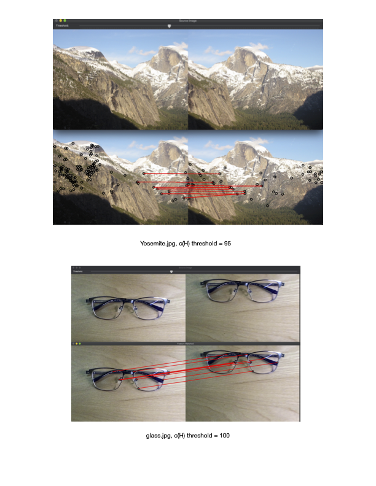
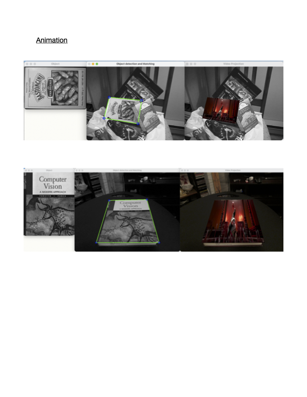

# CS 5391 Intro to Computer Vision  

## Project 1. Generate Hybrid Image  

  

## Project 2. Feature Detection and Matching  

  

  
  
## Project 3. AR - Project a dynamic animated video using planar homographies  
  
